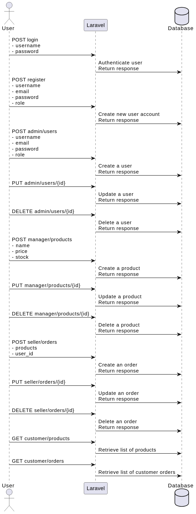

# AV2 Arquitetura de Aplicações Web

Aplicação desenvolvida para a AV2 do professor [João Aramuni](https://github.com/joaopauloaramuni)

[Requisitos](requisitos.pdf)

A aplicação possui um docker compose e o dockerfile do projeto, bastando utilizar o comando

```bash
docker compose up -d --build
```

Isso irá iniciar a api na porta local 8080, e um dashboard do mongodb na porta local 8081

A maior parte dos arquivos de regra de negócio está na pasta `app`, os principais sendo:

[Controllers](app/Http/Controllers/)  
[Models Para Salvar no banco em](app/Models/)  
[Rotas em](routes/api.php)

# Descrição das Rotas

Este arquivo descreve as rotas API definidas em sua aplicação Laravel. Essas rotas mapeiam requisições HTTP de entrada (especificamente requisições POST) para suas respectivas ações.

**Rotas de Autenticação**

-   **POST login:** Autentica um usuário e retorna uma resposta (provavelmente um token JWT ou outros dados de autenticação).
    -   Dados do usuário (no corpo da requisição POST):
        -   `username`: Nome de usuário (obrigatório)
        -   `password`: Senha (obrigatório)
-   **POST register:** Cria uma nova conta de usuário.
    -   Dados do usuário (no corpo da requisição POST):
        -   `username`: Nome de usuário (obrigatório)
        -   `email`: Endereço de e-mail (obrigatório)
        -   `password`: Senha (obrigatório)
        -   `role`: Função do usuário (obrigatório, entre admin, manager, seller, customer)

**Função: admin**

-   **POST admin/users:** Criar um usuário.
    -   Dados do usuário (no corpo da requisição POST):
        -   `username`: Nome de usuário (obrigatório)
        -   `email`: Endereço de e-mail (obrigatório)
        -   `password`: Senha (obrigatório)
        -   `role`: Função do usuário (opcional)
-   **PUT admin/users/{id}:** Atualizar um usuário. (substitua `{id}` pelo identificador do usuário)
-   **DELETE admin/users/{id}:** Excluir um usuário. (substitua `{id}` pelo identificador do usuário)

**Função: manager**

-   **POST manager/products:** Criar um produto.
    -   Dados do produto (no corpo da requisição POST):
        -   `name`: Nome do produto (obrigatório)
        -   `price`: Preço do produto (obrigatório)
        -   `stock`: Quantidade em estoque do produto (obrigatório)
-   **PUT manager/products/{id}:** Atualizar um produto. (substitua `{id}` pelo identificador do produto)
-   **DELETE manager/products/{id}:** Excluir um produto. (substitua `{id}` pelo identificador do produto)

**Função: seller**

-   **POST seller/orders:** Criar um pedido.
    -   Dados do pedido (no corpo da requisição POST):
        -   `products`: Array de IDs de produtos (obrigatório)
        -   `user_id`: ID do usuário que realizou o pedido (obrigatório)
-   **PUT seller/orders/{id}:** Atualizar um pedido. (substitua `{id}` pelo identificador do pedido)
-   **DELETE seller/orders/{id}:** Excluir um pedido. (substitua `{id}` pelo identificador do pedido)

**Função: customer**

-   **GET customer/products:** Recuperar uma lista de produtos.
-   **GET customer/orders:** Recuperar uma lista de pedidos do cliente. (requer autenticação)

**Observação:**

-   Substitua `{id}` pelo identificador do recurso na rota PUT e DELETE.

Este README fornece uma visão geral das rotas, separadas por função, e descreve os dados esperados no corpo das requisições POST.

### Tecnologias Utilizadas

-   **Laravel:** Framework PHP popular para desenvolvimento web, fornecendo estrutura robusta, sintaxe expressiva e diversos recursos para facilitar a criação de aplicações web modernas.
-   **Laravel MongoDB:** Pacote oficial do Laravel para integração com o banco de dados MongoDB, permitindo fácil manipulação de dados JSON e consultas flexíveis usando a linguagem de consulta do MongoDB.
-   **PHP:** Linguagem de script de propósito geral amplamente utilizada para desenvolvimento web, oferecendo simplicidade, flexibilidade e ampla comunidade de suporte.
-   **MongoDB:** Banco de dados NoSQL não relacional que armazena dados em documentos JSON, proporcionando escalabilidade horizontal, consultas eficientes e flexibilidade para modelagem de dados complexos.

### Diagrama das requisições



### Resumo

- Aplicação Web para AV2 do Professor João Aramuni

-Desenvolvida em Laravel e utiliza MongoDB como banco de dados.

- Documentação completa com diagramas de fluxo de requisições.

- Funcionalidades por função de usuário (admin, manager, seller, customer).

- Autenticação com login e registro de usuários.

- CRUD completo para usuários, produtos e pedidos.

- Tecnologias: Laravel, Laravel MongoDB, PHP, MongoDB.
